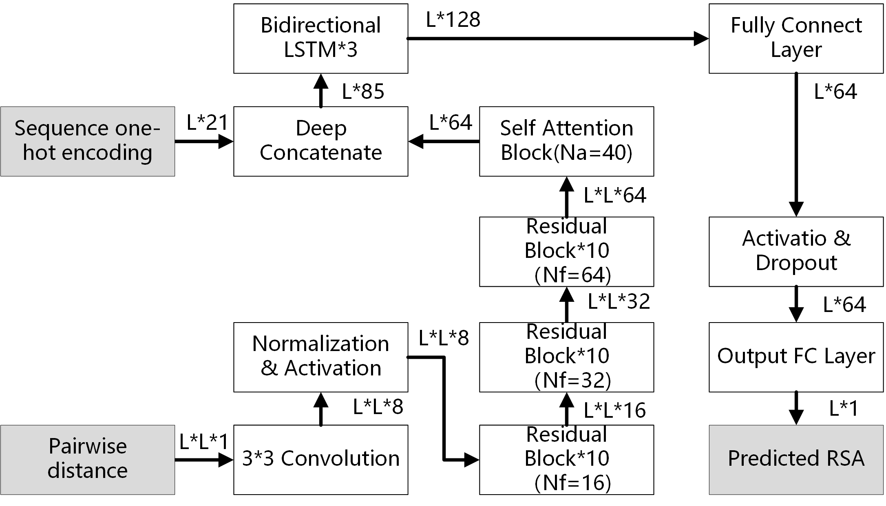

# EAGERER
Precise estimation of residue relative solvent accessible area from Cα atom distance matrix using deep learning method 

## Software you need to install 
1. You need to install torch. 
https://pytorch.org/get-started/locally/

2. Biopython
conda install -c anaconda biopython

3. numpy  & pandas
conda install numpy
conda install pandas

## Usage
You can run EAGERER in following ways:
1. run *sh
sh run.sh 

2. or  run *py
python ./bin/EAGERER.py  eg.list

3. You can run the docker version of EAGERER in ./EAGERER4Docker

## Example

sh run.sh 

## Contact
If you have any questions, please contact gaojz AT nankai.edu.cn

## Reference
Jianzhao Gao*, Shuangjia Zheng, Mengting Yao, Peikun Wu,Precise estimation of residue relative solvent accessible area from Cα atom distance matrix using deep learning method. Bioinformatics. 2021 Aug 27:btab616. doi: 10.1093/bioinformatics/btab616. Epub ahead of print. PMID: 34450651.
